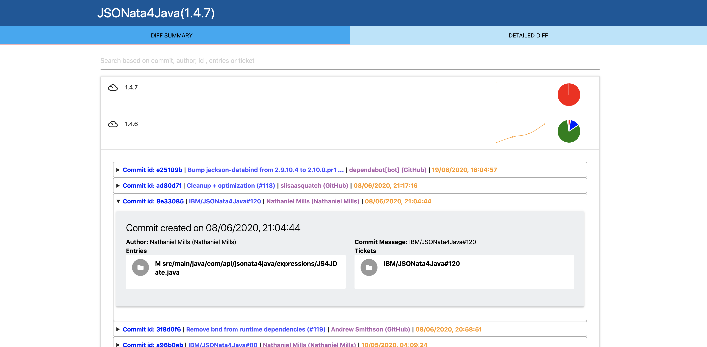
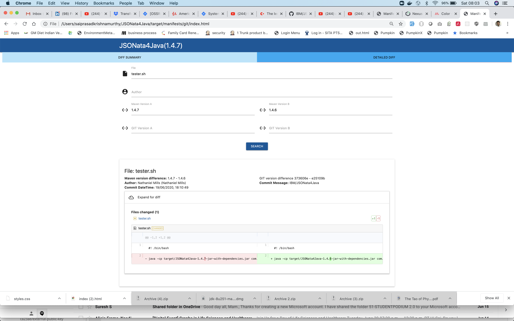

## SPRINGBOOT MANIFEST MAVEN PLUGIN

### Maven Plugin to generate the following manifest files.
* Git version tree with the maven version in a JSON and HTML so it can be packaged in the jar file as version metadata.
* Kubernetes Deployment files and Config Map files pairs for every spring profile (application-<XXXX>.properties)

## GIT Manifests generation:
```
<plugin>
    <groupId>com.github.saiprasadkrishnamurthy</groupId>
    <artifactId>springboot-manifest-maven-plugin</artifactId>
    <version>2.7</version>
    <executions>
        <execution>
            <id>generate-git-manifests</id>
            <goals>
                <goal>generate-git-manifests</goal>
            </goals>
        <configuration>
            <!-- eg: JIRA ID patterns of your project -->
            <ticketPatterns>SPR-[0-9]+,IABC-[0-9]+</ticketPatterns> 
            <skip>false</skip> <!-- Optional default false-->
            <outputDir>target/manifests/git</outputDir> <!-- Optional, defaults to target/manifests/git -->
            <maxNoOfMavenVersionsForDiffsDump>2</maxNoOfMavenVersionsForDiffsDump>
        </configuration>
        </execution>
    </executions>
</plugin>
```

### The generated GIT Manifests HTML will look like this (which can be bundled into any JAR file)
## Versions Summary screen


## Detailed Differences screen


Thanks to Nick (https://github.com/nickx720) for his contribution towards the UI :-)

### Plugin configuration options
Option | Description | Default | Notes |
----- | --- | --- |---| 
skip | Skips the plugin execution | false | NA  
outputDir | Out dir where the GIT manifest files will be generated | target/manifests/git |  NA 
maxRevisions | Maximum number of git revisions to extract from current  | 100 |  The more the number, the more time it may take.
ticketPatterns | Comma separated list of the ticket (bug or feature) regex patterns of this artifact.  |  |   Ticket numbers are extracted from the commit messages if matched.
runOnBranchPatterns | Execute this plugin only on the branch matching the patterns (comma separated regular expressions).  | master | NA 
maxNoOfMavenVersionsForDiffsDump | If you are interested in extracting the detailed diff (file contents), this is the max number of maven versions (including the current) to extract the detailed diffs for.  | optional | Higher the number, more the time it may take to extract the detailed diffs.| NA    
transitiveDepsDatabaseDump (Boolean) | If you want the version metadata of this artifact and it's transitive dependencies to be dumped into an sqlite db file | optional (defaults to false) | Use it for top level artifacts (micro services.jar) where you want to have a single DB dump of all the version information of all the artifacts. | NA    

#### If transitiveDepsDatabaseDump is set to true, the following is the schema of the SQLITE table.
Column | Description | Datatype |
----- | --- | --- |
GITSHA | Git Commit SHA | string |  
ARTIFACTID | maven artifact id | string |  
MAVENVERSION | Maven version | string |  
TIMESTAMP | Commit timestamp | long |  
AUTHOR | Commit Author | string |  
COMMITMESSAGE | Commit message | string |  
TICKETS | Issue/Feature tickets for this commit | string |  
ENTRIES | List of files for this commit | string |  
DAY | Day of commit in dd/MM/yy | string |
  


### Kubernetes Manifests.
Imagine we have the following application properties files in a regular spring boot app.
```
 src
   main
     resources
        application.properties
        application-dev.properties
        application-qa.properties
        application-stage.properties
        application-prod.properties
```

The springboot application would then need to supply a deployment.yml and configmap.yml template with variables:

### Deployment.yml template example (note that all the variables defined in the application.properties can be accessed here)
In addition to that there are implicit variables: such as `artifactId, version, gitVersion, configMapTemplateName, imageName, replicas, minReadySeconds` available for use.
```
apiVersion: extensions/v1beta1
kind: Deployment
metadata:
  labels:
    app: ${artifactId}
  name: ${artifactId}
  namespace: default
spec:
  replicas: ${replicas}
  minReadySeconds: ${minReadySeconds}
  selector:
    matchLabels:
      app: ${artifactId}
  strategy:
    rollingUpdate:
      maxSurge: 25%
      maxUnavailable: 25%
    type: RollingUpdate
  template:
    metadata:
      labels:
        app: ${artifactId}
    spec:
      containers:
        - name: ${artifactId}
          image: ${imageName}
          imagePullPolicy: Always
          ports:
            - name: liveness-port
              containerPort: ${server.port}
          resources:
            requests:
              cpu: 100m
              memory: 512Mi
            limits:
              cpu: 500m
              memory: 1024Mi
          readinessProbe:
            httpGet:
              path: /
              port: liveness-port
            failureThreshold: 5
            periodSeconds: 10
            initialDelaySeconds: 60
          livenessProbe:
            httpGet:
              path: /
              port: liveness-port
            failureThreshold: 5
            periodSeconds: 10
            initialDelaySeconds: 60
      restartPolicy: Always
      terminationGracePeriodSeconds: 30
---
apiVersion: v1
kind: Service
metadata:
  labels:
    app: ${artifactId}
  name: ${artifactId}
  namespace: default
spec:
  type: NodePort
  ports:
    - port: ${server.port}
      protocol: TCP
      name: http
  selector:
    app: ${artifactId}
  sessionAffinity: None
```

### ConfigMap.yml template example (note that all the variables defined in the application.properties can be accessed here)
```
apiVersion: v1
kind: ConfigMap
metadata:
  name: ${configMapTemplateName}
  namespace: default
data:
${properties}
```
Note that `${properties}` will be replaced with all the properties resolved from the application*.properties per environment.

### The values of the variables are resolved in the same way as Spring would resolve it (application.properties --> application-<xxx>.properties).

### Output produced.
The above example would produce 5 pairs of Kubernetes manifest files (each pair per environment).
* deployment.yml, configMap.yml - **base** 
* deployment_dev.yml, configMap_dev.yml - **dev** 
* deployment_qa.yml, configMap_qa.yml - **qa** 
* deployment_stage.yml, configMap_stage.yml - **stage** 
* deployment_prod.yml, configMap_prod.yml - **prod**

## Usage for Kubernetes Manifests generation:
```
<plugin>
    <groupId>com.github.saiprasadkrishnamurthy</groupId>
    <artifactId>springboot-manifest-maven-plugin</artifactId>
    <version>2.7</version>
    <executions>
        <execution>
            <id>generate-k8s-manifests</id>
            <goals>
                <goal>generate-k8s-manifests</goal>
            </goals>
        <configuration>
            <dockerImageNamespace>saiprasadkrishnamurthy</dockerImageNamespace>
            <deploymentYmlTemplateFile>deployment/deployment.yml</deploymentYmlTemplateFile>
            <configMapYmlTemplateFile>deployment/configMap.yml</configMapYmlTemplateFile>
            <skip>false</skip> <!-- Optional default false -->
            <outputDir>target/manifests/k8s</outputDir> <!-- Optional, defaults to target/manifests/k8s -->
        </configuration>
        </execution>
    </executions>
</plugin>
```

 
